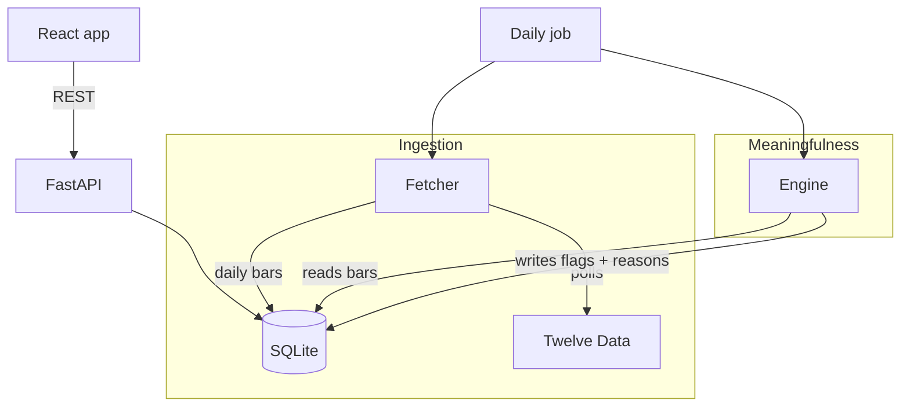

# Architecture

This is the longer version of "how it works and why." The README covers setup and the short reasoning; this file is the part I'd want to be able to talk through in detail.

## The shape of it

Three responsibilities are kept apart on purpose:

- The **fetcher** is the only thing that talks to the market data provider. It fetches daily bars, normalizes them, stores them, and knows nothing about what "meaningful" means.
- The **engine** reads stored bars and decides which stocks are worth attention. It never calls the provider and never talks to the user.
- The **API** does CRUD and serves flags that were already computed. It's thin.

The reason for splitting it this way is that the provider is the least reliable part of the system — rate limits, delays, downtime. Quarantining all of that in the fetcher means the rest of the app reasons over clean stored data and keeps working even if the provider is down when you open the app. It also means the engine can be tested on its own by handing it fake numbers.

## Data model

Five tables: `users`, `instruments`, `watchlist_items`, `observations`, `change_events`.

The decision that shapes everything: **observations and change_events hang off the instrument, not the user.** Market data and meaningfulness are properties of a stock, not of a person watching it. So if 50 people watch AAPL, there's one set of AAPL bars and one computation, shared. If I'd keyed them per watchlist entry, I'd fetch and compute AAPL 50 times. This is also why adding users is cheap — it doesn't multiply the data or the work.

A few other choices baked into the schema:

- `change_events.reasons` is a JSON list of human-readable strings, written when the flag fires. Storing the reasons as data (not reconstructing them at display time) is what makes "why is this here" an actual stored fact.
- `change_events` is append-only — one row each time a stock is flagged — so there's a history, not just a current state.
- A single `last_seen_at` timestamp on the user. No per-stock read/unread state anywhere (more on this below).
- Unique constraints on `(user_id, instrument_id)` and `(instrument_id, bar_date)` — you can't watch the same stock twice, and a re-fetch updates a day's bar instead of duplicating it.

## The engine

This is the core, so here's the actual math.

Everything is measured against the stock's own recent behavior over a baseline of its last 30 daily bars. Three signals:

**Price move.** Take the daily returns over the baseline, compute their standard deviation (the stock's normal daily volatility). Fire if today's return is at least 2 standard deviations out. The reason reads like "Price moved up 3.6x its typical daily range."

**Volume.** Compare today's volume to the average over the baseline. Fire at 2x or more.

**Index-relative move.** Subtract the market's return for the same day (using SPY as the proxy) from the stock's return, then measure that leftover against the stock's own volatility. Fire at 1.5 standard deviations. This is the one that separates "the whole market moved" from "this stock moved." If SPY data isn't available for the day, this signal just doesn't fire — the other two still work.

**Combining them.** Signals don't fire independently. Each fired signal contributes a strength equal to how far past its own threshold it got (so a signal exactly at its bar contributes 1.0). A stock is only flagged if **at least two** signals fire on the same day. The strengths are summed into a score; a score of 3.0 or more is high confidence, otherwise medium. Minimum possible flagged score is 2.0 (two signals just clearing their bars).

Requiring co-occurrence is the main thing keeping the feed quiet. A lone signal is treated as noise. It also means a stock that moved 5% purely because the market moved 5% won't flag — the price signal fires, but the index signal cancels, and one signal isn't enough.

All the thresholds live in one config file so they're easy to defend and to tune with real data in front of you.

### The capped lookback

The baseline for the "unusual?" check is always the last 30 days, regardless of how long the user has been away. This matters for the returning-after-months case: a stock can drift 40% over six months with nothing anomalous actually happening, and comparing today against a six-month-old point would flag that drift as meaningful, which it isn't. Volume anomalies don't even make sense against an old baseline.

So the anomaly detection is absence-independent. Time since last visit is used for two other things: capping which recent flags a returning user sees (at 30 days), and the plain "up 22% since you last checked" context line — which is shown as information, never treated as a signal.

## When things get computed

The engine runs on a schedule, not on every request.

A daily job (weekday evenings, after the US close) refreshes SPY and every watched instrument, then re-evaluates each one and writes any flags. When a user adds a new ticker, a background task fetches its history and evaluates it once immediately, so it isn't blank until the next nightly run.

I didn't compute on read, for a few reasons. Daily data only changes once a day, so recomputing on every page load would produce the same answer repeatedly. On-read would also re-couple the request to the provider — a slow or down provider would hang the page — and would recompute the same shared instrument once per user. Computing when the data changes, and serving the stored result, avoids all three.

There's no separate cache layer, and that's deliberate. The `change_events` table is effectively the cache — the read path is already just a database lookup. Adding Redis would be caching a cache.

The scheduler is APScheduler running in the app process. At single-node scale that's fine. If this ran across multiple processes I'd pull the job out into system cron or a real queue, but a task broker now would be infrastructure for a problem I don't have.

## The provider boundary

Two rules the code holds to:

1. Only the fetcher module imports the Twelve Data client. Everything else is one function call away from the provider, which is what makes it swappable and testable.
2. No user request's success depends on the provider being up at that moment. The feed reads from the database. Adding a ticker writes the watchlist row and returns right away; the actual fetch happens afterward in a background task. So a slow or down provider gives you a "fetching…" row, not a failed request.

The provider authenticates with the key in the URL, so any HTTP error from the client carries the key in its message. The fetcher catches those and re-raises a clean error without the URL, so the key can't leak into logs or responses.

## What changed since you last looked

This runs on a single `last_seen_at` timestamp per user. Reading the feed is a pure read — it doesn't move the cursor, because if it did, refreshing the page would shrink the window to nothing and clear your feed. The cursor moves only when you click "Mark as reviewed."

So the semantics are "since you last reviewed," not "since you last visited." I picked that over two alternatives: update-on-read (self-clears the feed on refresh) and per-item acknowledgment (adds read/unread state per stock to the data model, which I didn't want). One timestamp, one explicit action, no extra state.

## Stale data, conflicts, market hours

There's one data source, so there's no live conflict to resolve — that was a deliberate call rather than building reconciliation for a disagreement I'd be inventing. If I added a second source, I'd prefer the fresher timestamp and flag divergence rather than silently averaging.

In the daily job, a failure on one instrument (a bad symbol, a rate limit) is caught and skipped so it doesn't abort the whole run — a stale stock is better than a dead refresh.

On weekends and holidays there's no new bar, so the job has nothing to add and the feed shows the last trading day's state.

## Auth

Email and password, hashed with bcrypt, with a signed token (HS256, seven-day expiry) sent as a bearer header. Real accounts because per-user state is the whole product, but deliberately minimal — no OAuth, no refresh tokens, no password reset. Login returns the same error for a wrong email and a wrong password so it doesn't reveal which emails are registered.

## Where it would break, and what I'd change

SQLite in WAL mode handles the current pattern — many reads, one writer (the daily job). The seam is concurrent writers: once the job is fanning out writes across a lot of users at once, that single-writer model is the bottleneck. The fix is Postgres, which is a connection-string change plus a connection pool since it's all through an ORM, and pulling the scheduler out of the app process. None of that is worth doing now, but it's a clean path and I know exactly where the line is.

Because data and computation are per-instrument, adding users doesn't multiply either — that part already scales further than the database does.

## Edge cases the design handles

- **Empty or huge watchlists** — the feed is just whatever's flagged; zero flagged is the normal quiet state.
- **Returning after months** — capped lookback, covered above.
- **A stock in several watchlists** — one instrument row, shared data and flags.
- **A brand-new stock with no history** — signals need a minimum baseline before they'll fire, so a thin-history stock produces no signal rather than a false one.
- **A flat or zero baseline** — guarded, so no division by zero.
- **Provider down when you open the app** — reads come from stored data; nothing hangs.

## Tests

The signal math and the combination logic are unit-tested against hand-made inputs — a spike fires, a quiet day doesn't, a move that matches the market is suppressed, thin or flat history doesn't fire. The API (auth, watchlist, feed) is tested against a throwaway database with the provider stubbed out, so the tests don't touch the network.
